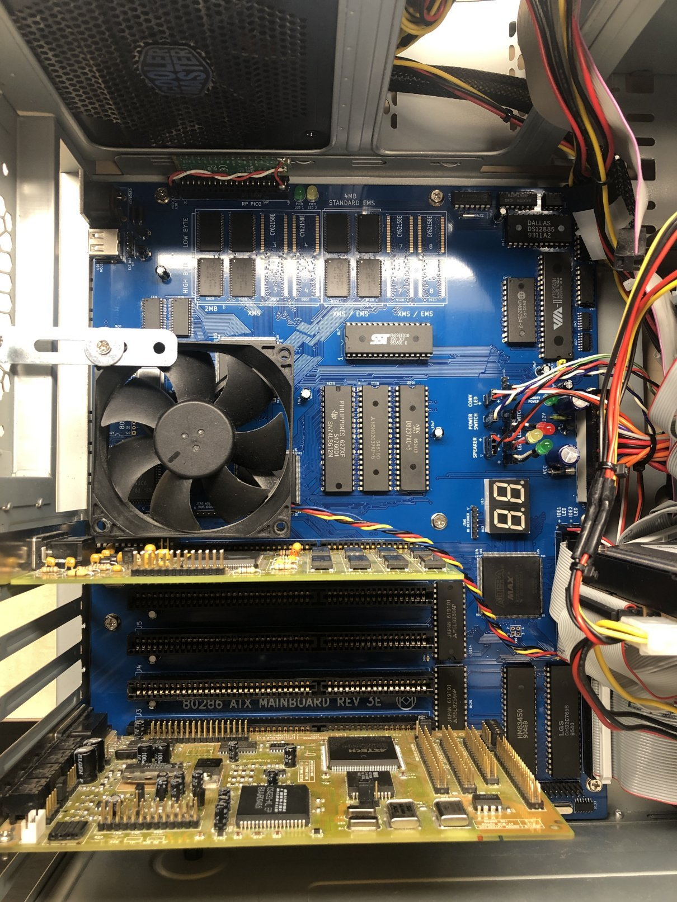
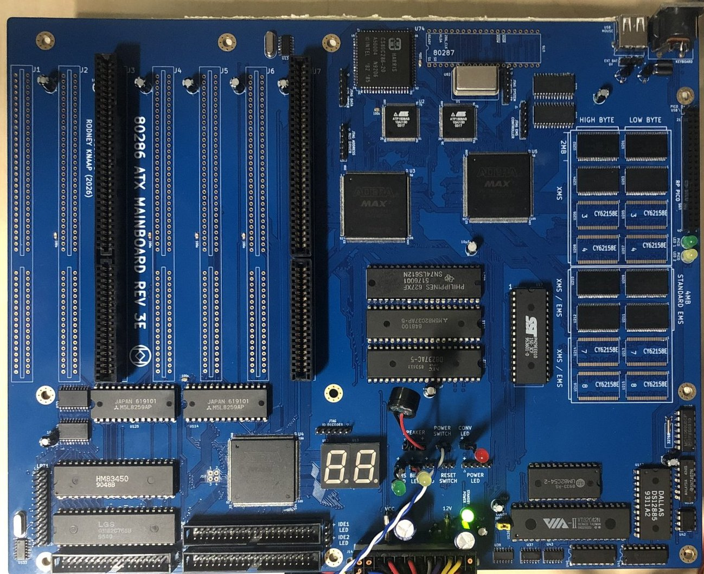
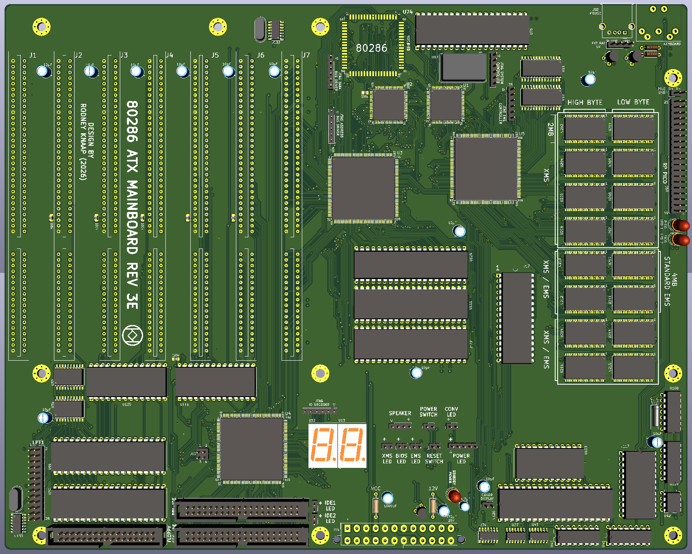
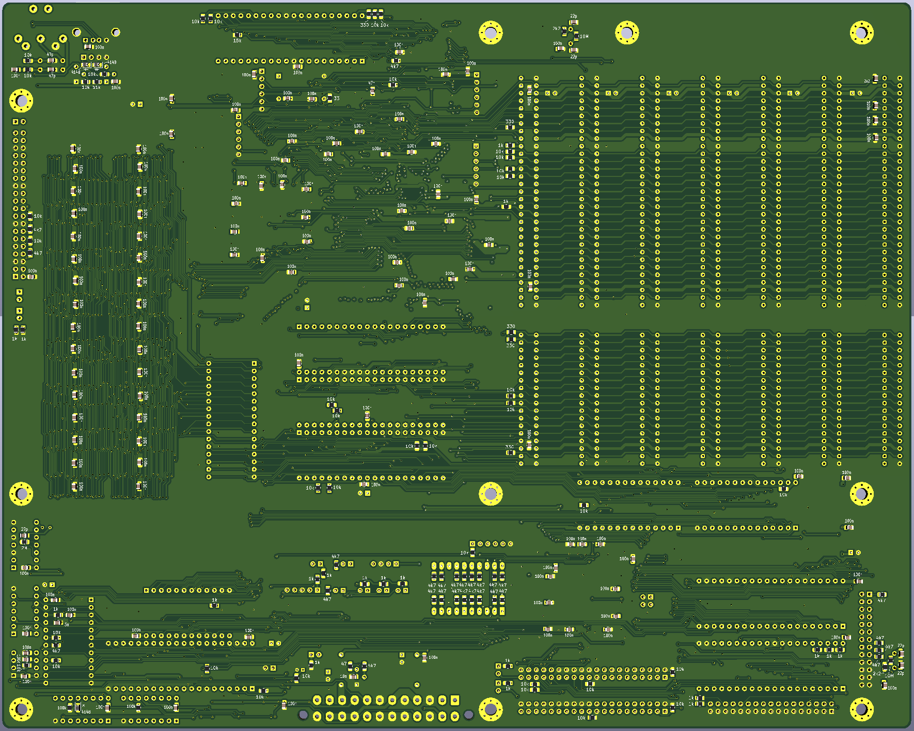

# ATX-286AT-V3E-mainboard
This project features the REV3E design for a 80286 ATX mainboard based on the IBM 5170 AT PC

   

   

   

   

## 286 PC/AT CPLD ATX mainboard REV3E  

This project is REV3E of my open source 286 AT ATX PC mainboard design using CPLD technology.
As with the first revision, the design is based on the original IBM 5170 PC/AT concept.

The project consists of an ATX mainboard supporting XMS and EMS according to the EMS drivers created by sqpat here on GitHub.

SRAM ICs can be added to the low and high byte position of the same set which will then result in 2MB of 16 bit mode SRAM available for that set position of the memory map.
The memory layout is also printed on the mainboard. The sets are numbered 1 to 8.  
Sets 1 to 4 are 8MB of XMS  
Sets 5 to 8 are 8MB which are able to double as XMS or EMS RAM.  

So a builder who wants to have XMS and EMS should populate RAM sets 5 and 6 to have 4MB of EMS, and would need to populate set 1 to have conventional RAM for the system.  
The sets 5 and 6 can be added to what is populated in sets 1 to 4 to increase the XMS capacity while EMS is not in use.  
So minimum to populate would be set 1 only which would lead to 2MB of XMS only. Besides this requirement, population is flexible.  
For example sets 1, 5 and 6 could be populated which results in 6MB of XMS of which 4MB can be used as EMS when EMS in use. Usually XMS and EMS are not combined at the same time because EMS is used in real mode of the 286 CPU.  Populating sets 1,2 and 5,6 can provide the system with 8MB of XMS of which 4MB of the XMS can double as EMS for running RealDOOM. Other configurations are also possible. Specific configurations require small logic updates in the EMS controller to adapt the system to the populated amounts of RAM.

The mainboard supports the 80286 16 bit CPU, bus driving is now completely done by CPLD logic.
A Harris 286 rated at 20MHz is recommended, certain older manufacturing dated chips are able to run at much higher clock speeds in other systems.
A good manufacturing year is 1992 for these Harris 20MHz chips. Later ones may not clock as high as earlier ones.

Basically for composing the core PC/AT system based on IBM 5170 technology all logic is now contained within 5 CPLD ICs.
A few TTL chips are added for the printer port output enabled parts. And a few CMOS chips to generate OSC and a 16MHz clock. These are then divided down by the IO decoder CPLD for other frequencies.  

When using the printer port, make sure to check the pins of the header in the schematic and make sure your cable matches those.
Printer port has not been tested yet in the current edition, however has been verified in other revisions using TTL ICs to comprise a printer port.

## Purpose and permitted use, cautions for a potential builder of this design
This project was created for historical purposes out of love for historical computing designs and for the purpose of enabling computing enthousiasts with a sufficient level of building and troubleshooting expertise to be able to experience the technology by building and troubleshooting the hardware described in this project. Due to the level of this project, it may be suitable as a project for students to get into. If there are any questions from teachers who like to teach about this technology I would be happy to answer them. It may be really interesting to analyse the elaborate and complex CPU timing and 8 bit to 16 bit data byte translation and DMA mechanisms in an educational setting.

Besides the GPL3 license there are a few warnings and usage restrictions applicable:
No guarantees of function or fitness for any particular or useful purpose is given, building and using this design is at the sole responsibility of the builder.

Do not attempt this project unless you have the necessary electronics assembly expertise and experience, and know how to observe all electronics safety guidelines which are applicable.

It is not permitted to use the computer built from this design without the assumption of the possibility of loss of data or malfunction of the connected device. To be used strictly for personal hobby and experimental purposes only. No applications are permitted where failure of the device could result in damage or injury of any kind.

If you plan to use this design or any part of it in new designs, the acknowledgement of the designer and the design sources and inspirations, historical and modern, of all subparts contained within this design should be included and respected in your publication, to accredit the hard work, time and effort dedicated by the people before you who contributed to make your project possible.

No guarantee for any proper operation or suitability for any possible use or purpose is given, using the resulting hardware from this design is purely educational and experimental and not intended for serious applications. Loss of data is likely and to be expected when connecting any storage device or storage media to the resulting system from this design, or when configuring or operating any storage device or media with the system of this design.

When connecting this system to a computer network which contains stored information on it, it is at the sole responsibility and risk of the person making the connection, no guarantee is given against data loss or data corruption, malfunctions or failure of the whole computer network and/or any information contained inside it on other devices and media which are connected to the same network.

When building this project, the builder assumes personal responsibility for troubleshooting it and using the necessary care and expertise to make it function properly as defined by the design. You can email me with questions, but I will reply only if I have time and if I find the question to be valid. Which will probably also lead to an update here. I want to primarily dedicate my time to new project development, I am not able to do any user support, so that's why I provide the elaborate info here which will be expanded if needed.

These disclaimers and conditions may seem unfriendly but remember that they are by no means meant to reflect on you as a reader personally or individually, just imagine that all possible people and unwise use and situations still need to be covered since this project is openly published on the internet, which means any person on the planet is able to find the information, thus also the comments are meant for every possible person who wants to use the information. I am reasonably assuming that 99% of people will be civilized enough to observe respect and common sense.

# REV3E design of a PC/AT mainboard based on CPLD technology  
For background information and previous acknowledgements, please first see the Rev3(D) design repository. 
The information provided here is purely meant to describe the differences and changes in the new REV3E design.
For clarity, only the files relevant to REV3E are featured here.
For completeness, please read the information in the REV3 repository first to understand the background of the project.  

The design features SRAM footprints on the mainboard rather than featuring modules. This makes construction of the board more simple and straight forward.
The SRAMs need to be populated in sets, one for the low and high byte of a set. Starting with RAM set 1, this is the minimum SRAM for the project and would amount to 2MB to be used as conventional and XMS RAM. If you want EMS RAM, then add sets of SRAMs in positions 5 and 6, which would create 4MB of EMS. With this, for example, the system can run the RealDOOM project as under development by sqpat here on GitHub. When populating set 1, 5 and 6, the EMS sets 5 and 6 can be dual purposed as additional XMS while EMS is not in use. So that could be made to amount as 6MB XMS sharing 4MB with the EMS system when loading the EMS driver. The system needs a RESET to disable the EMS system after loading the EMS driver, and the full 6MB of XMS will become available again after a RESET or power cycle.

The System controller contains cycle control logic which switches the 286 on a lower clock speed for speed sensitive memory and I/O operations. When these areas are detected, an alternate clock mode is implemented dynamically in specific points of the CPU clock cycles in order not to disrupt the clock cycle transitions while the CPU is executing cycles.

The Address driver/decoder CPLD in addition contains DMA specific logic in order not only to generate the system address bus from the CPU but also from the DMACs and a bus Master if present on the slot connector. The Address driver/decoder is also decoding all XMS and EMS memory in the system. For this purpose the Address driver/decoder communicates with the EMS controller in order to determine the selection of XMS or EMS memory for each area of system memory. By default, each page block of system memory is initially programmed to be a default page which is located in the XMS memory chips. When a certain block is reprogrammed in the EMS page registers, it will be remapped into any programmable block inside the EMS memory pool. By programming a memory block back to default, the original memory contents are mapped back into that 16KB page block.

# About the System controller CPLD  
The system controller CPLD is a timing sensitive design.
It has been verified in the REV3D system to be stable using a 44.8 MHz oscillator as the FCLOCK source.
Please note, the same frequency rating of the System controller CPLD must be used when building this design. Using CPLD logic with different timing may or may not be functional but this cannot be predicted at this time. Recommended rating of the System controller is 10ns. 
The exact chip used for debugging and testing is the Atmel "ATF1508AS 10AI100". 
For the larger 208 pin ALTERA CPLDs the type is EPM7256SQC208-10 which is also a 10ns rated chip.
In the REV3E design, the FCLOCK net has been reduced to only supply the clock to the System controller.
Previously it has been routed to other CPLDs however after debugging and development these connections were not in use and have been removed in REV3E in order to reduce the stray capacitance on the FCLOCK signal. In addition a 33 ohm resistor has been added in series with the oscillator footprint to possibly improve the clock edges.
This will need to be verified with testing and possibly the resistor needs to be bypassed if it causes adverse effects on the timing of the System controller.

The System controller is a sensitive design and needs to be left in roughly the same configuration as the REV3D system.
So the quartus project has been tested with the REV3D system to be fully functional at 44.8MHz FCLOCK.
A few preparations have been done and verified to be functional as well by modifying the REV3D system:
- moved the 16M clock and 8042_CLK output from the System controller to the IO decoder CPLD.
- disconnected RESET output pin 60 from the board net and supplied RESET from the EMS controller CPLD.
- removed the solder point footprints from the System controller
- created fixed traces between system controller, data bus driver and address bus driver CPLDs for possible future use
These changes have been verified with the REV3D system.
  
In the REV3D/REV3E System controller there are a few unused outputs which must remain in place for the time being:
- SYSCON_1 and SYSCON_2 must remain configured as buffered secondary outputs of /MEMR and /MEMW to the Data bus driver CPLD. These are not used but result in the quartus compilation outcome which has improved timing for VGA RAM cycles by the 286.
- the RESET output signal on pin 60 must remain in place in the quartus design. Removing this will result in distupting the system control timing and the POST halting at POST code 10  

In future programming of the System controller the design may be altered to a synchronous model using a higher clock speed to create more timing resolution, depending on the logic capacity of the CPLD to be sufficient or not. For this purpose I have prepared to reduce the functions and number of pins in use on the System controller CPLD further to the minimum requirement. Arguably the coprocessor control could be removed to use more logic for system control using a 286 only.

If a new System controller quartus design is created in the future, the pins currently left assigned and not actively driving other logic outside the System controller may then also be left unused in order to hopefully free up more logic capacity for the System control design.

# Regarding the component list  
I assembled a BOM file and added a few manual comments. 
So in the schematic some values etc may differ but the BOM PDF is more elaborate.
In the ATX circuits which operate on 5V standby I have tested the TTL ICs with HC types.
So this simplifies the partslist for the 74HC04 for the oscillators also to be used for the power circuits.
Also remember to check the PCB for the definitive footprint shapes if unclear.

# Status of the project  
The REV3D project PCB layout and initial starting point CPLD chipset projects have been created. The first build is finished and debugging is completed.
I have ran tests which will continue however these now all show indications of full stability.

Special thanks go out to Edzard on the VCF forum who has kindly offered to send me a manufactured REV3E board from his PCB order which he made from JLCPCB.
So I am happy to accept his offer which enables me to build an improved version of the REV3E design where we include additional design features which came to mind when building and using the REV3D system.

I have received an ENIG finish blue color REV3E board from Edzard and proceeded to desolder the REV3D board and transferred all the components onto the REV3E board.
This time I had a little more work to double check all the soldering which was mostly attributed to not having the correct soldering tips.
So it is recommended to use shorter tips and not any stepped model tips which don't have sufficient capacity to transfer heat for all types of soldering.
So shorter tips which have a solid structure are better, where we can use a wedge shaped tip for pre-tinning the QFP pads and reflowing the QFP CPLDs onto the pads.
In addition the more pointy tip can also be used for reflowing QFP pins and also are able to transfer sufficient heat for soldering SO SMD ICs and the 286 CPU where we are dealing with ground surfaces adjacent to certain pads. Being able to direct enough heat to these large surface pads we are able to solder these neatly in a single go. Also the page register SRAMs U10 and U11 require special care to be able to direct enough heat onto the GND pads involved there. For all SMD work it's necessary to make sure that at all times there is sufficient no-clean flux present on the pads before soldering. Same goes for pre-tinning QFP pads, there it's necessary to apply generous no-clean flux when pre-tinning and making a wiping movement with the iron while adding solder wire. The wiping should be kept as short as possible in duration in order to not compromise the pads by excessive heat treatment. The iron should be set around 350 degrees at most. After pre-tinning the board needs to be cleaned with IPA and then the CPLD can be positioned 100% straight, and while holding it in place and continually checking the alignment, heating a few middle pins on each side to fixate the QFP. Next a generous amound of no-clean flux can be added and all the pins can be reflowed in the direction of the length of the pins. So no solder is added besides the pre-tinning and we wipe the pins, not drag across them. The flux and heat applied will stimulate the pre-tinned solder from the pads to form a bond between the pin and pad. So all pins need to be solid checked by gently pressing them from the side with a thin tweezer tip. If the pin still moves it's not solid yet and it needs another reflowing treatment.

# Ensuring full stability  
There are a few critical points to observe which I have determined with the initial build and test.  
These points need to be followed or otherwise the build will not be stable at 22.4MHz CPU clock speed:  
- check and re-check your soldering work, if need be, reflow another time
- measure adjacent pins against any shorts, sometimes these may be difficult to spot
- beep out measure the SRAM pins from pad edge to the pin itself near the chip plastic to ensure a proper solder bond is formed
- there need to be large VCC capacitors on the following footprints:  
C68 - 1500µF or larger  
C63 - 3300µF  
C56 - 1000µF or larger, check the space, the VCC fuse can be moved to the side a little  
Voltage rating is recommended around 10V at least.  
- I am testing a 33 ohm resistor in series with the FCLOCK oscillator  
Unless otherwise updated here this is also a recommendation.  
- Putting the VGA card in slot J6 may be advisible. A Cirrus Logic card is strongly recommended. Many other VGA cards will not operate well with the CPU at above 20MHz. In my test case the far right slot J7 was not working well with the VGA card. This may have been caused by a bad slot connector however it may also be related to other causes so I want to mention this as a recommendation. In my case I experienced some freezing in RealDOOM, which was completely cured after moving the VGA card to J6. It may or not be related to the slot connector being bad. I also noticed when touching the VGA card in slot J7 I suddenly got a crash. So this makes me possibly suspect my slot J7 being faulty, however be aware of this issue and when seen, move the VGA card to J6. Best demonstration if any issue is present is running RealDOOM and continually letting it run through cycles of automatic demo games which start running automatically after starting RealDOOM. Symptoms of the VGA card having issues are that you may spot pixelation issues near the top status text in red, and freezing which may occur as soon as one minute after the demo is running. So in my case as described I found that after moving the card to J6, all the issues cleared up.
- the memory SRAMs are better soldered more solidly using the thinnest leaded solder wire you can find, using generous flux. I have seen pins which look and feel solid however I was not able to measure full conductivity in one of the pins. So this can be checked by measuring from the pad edge to the pin near the plastic top of the chip.

# CPLD projects: verified release 002  
I have uploaded CPLD a project release set 002 for two memory population schemes:  
- populate sets 1, 5 and 6 to enable 6MB of XMS, of which the top 4MB is taken control of by Patricks EMS driver  
- populate sets 1, 2, 5 and 6 to enable 8MB of XMS, of which the top 4MB is taken control of by Patricks EMS driver  
NB: For the memory configuration differences above, only the Address bus driver CPLD is different, all other CPLDs are the same.  
Filename for the Release 2 archive containing these versions is: REV3E_CPLD_CHIPSET_002_MAY_2026.zip

So Release 002 is the stable verified version of what is fully functional in my build as per the photos.
So all projects in release 002 are verified with the verify function of programming against the working system and 100% found identical with what is running stable on my build.

## Diagnostic version CPLD project  
There is a minimal diagnostics version of the Address bus driver now released here which only drives 2MB of XMS only operation, and otherwise disables any sections not necessary during the initial debugging phase. So this Address bus driver project is only meant for diagnostics, and should be reprogrammed with the release version which applies to your build after initial 2MB operation is found stable, so you can continue to test the full system operation.  
So this project may only provide useful help if you experience issues that you cannot trace in normal tests.  
It is what I used myself to get the initial POST going because I apparently had some soldering issues in the SRAM section and needed to do a few more reflows of the CPLDs until I got 2MB operation stable.  
Filename is: CPLD_CHIPSET_DIAGNOSTIC.zip  

The CPLD projects currently don't include being able to RESET from an IO port write, however this would be possible by updating the EMS controller.
So if you are programming software and have a need for this function, send me a message. For example, a software RESET could be used to disable the EMS function and default back to XMS after running RealDOOM, so a software RESET can also be used without needing to apply the RESET button. This option came to mind while working on the REV3E design that we can add this function and it may possibly be of use.

Kind regards,

Rodney

Last updated april 8th, 2026.
