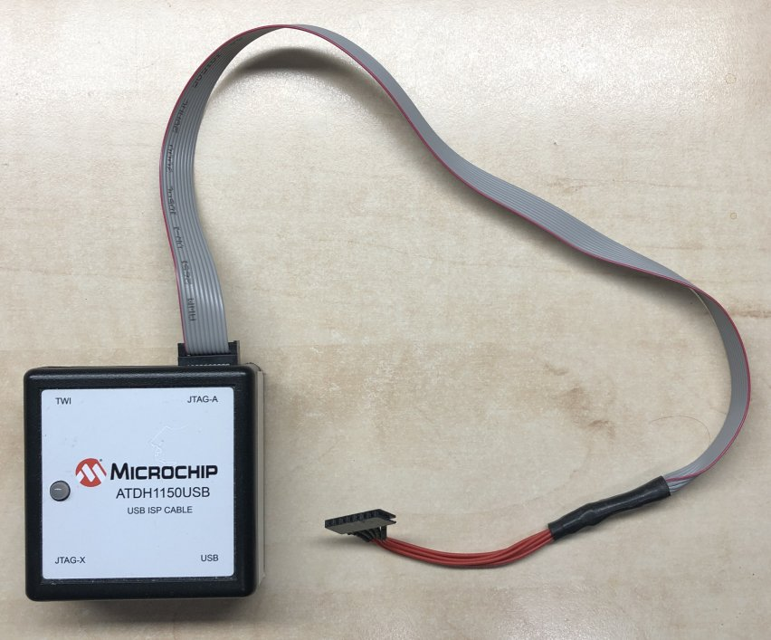

# ATX-286AT-V3E-mainboard
This project features the REV3E design for a 80286 ATX mainboard based on the IBM 5170 AT PC

   

   

   

   

## 286 PC/AT CPLD ATX mainboard REV3E  

This project is REV3E of my open source 286 AT ATX PC mainboard design using CPLD technology.
As with the first revision, the design is based on the original IBM 5170 PC/AT concept.

The project consists of an ATX mainboard supporting XMS and EMS according to the EMS drivers created by sqpat here on GitHub.

SRAM ICs can be added to the low and high byte position of the same set which will then result in 2MB of 16 bit mode SRAM available for that set position of the memory map.
The memory layout is also printed on the mainboard. The sets are numbered 1 to 8.  
Sets 1 to 4 are 8MB of XMS  
Sets 5 to 8 are 8MB which are able to double as XMS or EMS RAM.  

So a builder who wants to have XMS and EMS should populate RAM sets 5 and 6 to have 4MB of EMS, and would need to populate set 1 to have conventional RAM for the system.  
The sets 5 and 6 can be added to what is populated in sets 1 to 4 to increase the XMS capacity while EMS is not in use.  
So minimum to populate would be set 1 only which would lead to 2MB of XMS only. Besides this requirement, population is flexible.  
For example sets 1, 5 and 6 could be populated which results in 6MB of XMS of which 4MB can be used as EMS when EMS in use. Usually XMS and EMS are not combined at the same time because EMS is used in real mode of the 286 CPU.  Populating sets 1,2 and 5,6 can provide the system with 8MB of XMS of which 4MB of the XMS can double as EMS for running RealDOOM. Other configurations are also possible. Specific configurations require small logic updates in the EMS controller to adapt the system to the populated amounts of RAM.

The mainboard supports the 80286 16 bit CPU, bus driving is now completely done by CPLD logic.
A Harris 286 rated at 20MHz is recommended, certain older manufacturing dated chips are able to run at much higher clock speeds in other systems.
A good manufacturing year is 1992 for these Harris 20MHz chips. Later ones may not clock as high as earlier ones.

Basically for composing the core PC/AT system based on IBM 5170 technology all logic is now contained within 5 CPLD ICs.
A few TTL chips are added for the printer port output enabled parts. And a few CMOS chips to generate OSC and a 16MHz clock. These are then divided down by the IO decoder CPLD for other frequencies.  

When using the printer port, make sure to check the pins of the header in the schematic and make sure your cable matches those.
Printer port has not been tested yet in the current edition, however has been verified in other revisions using TTL ICs to comprise a printer port.

## Purpose and permitted use, cautions for a potential builder of this design
This project was created for historical purposes out of love for historical computing designs and for the purpose of enabling computing enthousiasts with a sufficient level of building and troubleshooting expertise to be able to experience the technology by building and troubleshooting the hardware described in this project. Due to the level of this project, it may be suitable as a project for students to get into. If there are any questions from teachers who like to teach about this technology I would be happy to answer them. It may be really interesting to analyse the elaborate and complex CPU timing and 8 bit to 16 bit data byte translation and DMA mechanisms in an educational setting.

Besides the GPL3 license there are a few warnings and usage restrictions applicable:
No guarantees of function or fitness for any particular or useful purpose is given, building and using this design is at the sole responsibility of the builder.

Do not attempt this project unless you have the necessary electronics assembly expertise and experience, and know how to observe all electronics safety guidelines which are applicable.

It is not permitted to use the computer built from this design without the assumption of the possibility of loss of data or malfunction of the connected device. To be used strictly for personal hobby and experimental purposes only. No applications are permitted where failure of the device could result in damage or injury of any kind.

If you plan to use this design or any part of it in new designs, the acknowledgement of the designer and the design sources and inspirations, historical and modern, of all subparts contained within this design should be included and respected in your publication, to accredit the hard work, time and effort dedicated by the people before you who contributed to make your project possible.

No guarantee for any proper operation or suitability for any possible use or purpose is given, using the resulting hardware from this design is purely educational and experimental and not intended for serious applications. Loss of data is likely and to be expected when connecting any storage device or storage media to the resulting system from this design, or when configuring or operating any storage device or media with the system of this design.

When connecting this system to a computer network which contains stored information on it, it is at the sole responsibility and risk of the person making the connection, no guarantee is given against data loss or data corruption, malfunctions or failure of the whole computer network and/or any information contained inside it on other devices and media which are connected to the same network.

When building this project, the builder assumes personal responsibility for troubleshooting it and using the necessary care and expertise to make it function properly as defined by the design. You can email me with questions, but I will reply only if I have time and if I find the question to be valid. Which will probably also lead to an update here. I want to primarily dedicate my time to new project development, I am not able to do any user support, so that's why I provide the elaborate info here which will be expanded if needed.

These disclaimers and conditions may seem unfriendly but remember that they are by no means meant to reflect on you as a reader personally or individually, just imagine that all possible people and unwise use and situations still need to be covered since this project is openly published on the internet, which means any person on the planet is able to find the information, thus also the comments are meant for every possible person who wants to use the information. I am reasonably assuming that 99% of people will be civilized enough to observe respect and common sense.

# REV3E design of a PC/AT mainboard based on CPLD technology  
For background information and previous acknowledgements, please first see the Rev3(D) design repository. 
The information provided here is purely meant to describe the differences and changes in the new REV3E design.
For clarity, only the files relevant to REV3E are featured here.
For completeness, please read the information in the REV3 repository first to understand the background of the project.  

The design features SRAM footprints on the mainboard rather than featuring modules. This makes construction of the board more simple and straight forward.
The SRAMs need to be populated in sets, one for the low and high byte of a set. Starting with RAM set 1, this is the minimum SRAM for the project and would amount to 2MB to be used as conventional and XMS RAM. If you want EMS RAM, then add sets of SRAMs in positions 5 and 6, which would create 4MB of EMS. With this, for example, the system can run the RealDOOM project as under development by sqpat here on GitHub. When populating set 1, 5 and 6, the EMS sets 5 and 6 can be dual purposed as additional XMS while EMS is not in use. So that could be made to amount as 6MB XMS sharing 4MB with the EMS system when loading the EMS driver. The system needs a RESET to disable the EMS system after loading the EMS driver, and the full 6MB of XMS will become available again after a RESET or power cycle.

The System controller contains cycle control logic which switches the 286 on a lower clock speed for speed sensitive memory and I/O operations. When these areas are detected, an alternate clock mode is implemented dynamically in specific points of the CPU clock cycles in order not to disrupt the clock cycle transitions while the CPU is executing cycles.

The Address driver/decoder CPLD in addition contains DMA specific logic in order not only to generate the system address bus from the CPU but also from the DMACs and a bus Master if present on the slot connector. The Address driver/decoder is also decoding all XMS and EMS memory in the system. For this purpose the Address driver/decoder communicates with the EMS controller in order to determine the selection of XMS or EMS memory for each area of system memory. By default, each page block of system memory is initially programmed to be a default page which is located in the XMS memory chips. When a certain block is reprogrammed in the EMS page registers, it will be remapped into any programmable block inside the EMS memory pool. By programming a memory block back to default, the original memory contents are mapped back into that 16KB page block.

# About the System controller CPLD  
The system controller CPLD is a timing sensitive design.
It has been verified in the REV3D system to be stable using a 44.8 MHz oscillator as the FCLOCK source.
Please note, the same frequency rating of the System controller CPLD must be used when building this design. Using CPLD logic with different timing may or may not be functional but this cannot be predicted at this time. Recommended rating of the System controller is 10ns. 
The exact chip used for debugging and testing is the Atmel "ATF1508AS 10AI100". 
For the larger 208 pin ALTERA CPLDs the type is EPM7256SQC208-10 which is also a 10ns rated chip.
In the REV3E design, the FCLOCK net has been reduced to only supply the clock to the System controller.
Previously it has been routed to other CPLDs however after debugging and development these connections were not in use and have been removed in REV3E in order to reduce the stray capacitance on the FCLOCK signal. In addition a 33 ohm resistor has been added in series with the oscillator footprint to possibly improve the clock edges.
This will need to be verified with testing and possibly the resistor needs to be bypassed if it causes adverse effects on the timing of the System controller.

The System controller is a sensitive design and needs to be left in roughly the same configuration as the REV3D system.
So the quartus project has been tested with the REV3D system to be fully functional at 44.8MHz FCLOCK.
A few preparations have been done and verified to be functional as well by modifying the REV3D system:
- moved the 16M clock and 8042_CLK output from the System controller to the IO decoder CPLD.
- disconnected RESET output pin 60 from the board net and supplied RESET from the EMS controller CPLD.
- removed the solder point footprints from the System controller
- created fixed traces between system controller, data bus driver and address bus driver CPLDs for possible future use
These changes have been verified with the REV3D system.
  
In the REV3D/REV3E System controller there are a few unused outputs which must remain in place for the time being:
- SYSCON_1 and SYSCON_2 must remain configured as buffered secondary outputs of /MEMR and /MEMW to the Data bus driver CPLD. These are not used but result in the quartus compilation outcome which has improved timing for VGA RAM cycles by the 286.
- the RESET output signal on pin 60 must remain in place in the quartus design. Removing this will result in distupting the system control timing and the POST halting at POST code 10  

In future programming of the System controller the design may be altered to a synchronous model using a higher clock speed to create more timing resolution, depending on the logic capacity of the CPLD to be sufficient or not. For this purpose I have prepared to reduce the functions and number of pins in use on the System controller CPLD further to the minimum requirement. Arguably the coprocessor control could be removed to use more logic for system control using a 286 only.

If a new System controller quartus design is created in the future, the pins currently left assigned and not actively driving other logic outside the System controller may then also be left unused in order to hopefully free up more logic capacity for the System control design.

# Regarding the component list  
I assembled a BOM file and added a few manual comments.  
So in the schematic some values etc may differ but the BOM PDF is more elaborate.
In the ATX circuits which operate on 5V standby I have tested the TTL ICs with HC types.
So this simplifies the partslist for the 74HC04 for the oscillators also to be used for the power circuits.
Also remember to check the PCB for the definitive footprint shapes whether these fit what you are ordering if unclear.  
(may 16th, 2026) A few capacitors are changed for stability reasons following the debug process, check the updated component list V002.  
In addition the USB mouse connector should be a type "A", check the footprint shape on the board to ensure your connector will fit.

# Status of the project  
The REV3E project PCB layout gerber files are released. The first build is finished and debugging is completed.
I have ran tests which will continue however these now all show indications of full stability.
A small gerber update 'U1' was done following the first build, to add a few elco capacitors and some capacitors were moved slightly on the bottom. 
See the top and bottom component view PDF files.  
Otherwise no changes are made to the structural design itself in the U1 update.  

# CPLD programming details
The stable verified CPLD release version is release 002. This requires Quartus II version 13.0 SP1.
This release has been tested for hours of continued test operation without issues using a variation of tests.  

Check the updated component list, and possibly a recommendation that the Cirrus Logic VGA card needs to be installed in J6 which may improve the operation with RealDOOM.  

You will need a Atmel ATDH1150USB programmer for the 100 pin System controller CPLD and Data bus driver CPLD. This device can program the JED files into the CPLDs using ATMISP software version 7.3 by Microchip. Choose the option to add new device (CTRL-A), after which device leave at "0", set device to ATF1508AS, JTAG instruction "Program/verify", then browse for the correct .JED file for the device connected with JTAG. The system must be powered on right before programming, then press the "Run" button.  

For the 208 pin CPLDs these can be programmed directly from quartus using a cheap Altera USB blaster device. First compile the project by pressing the triangle "play" button. After full compilation is completed, you can press the programmer icon. There you can define the programming hardware using the "hardware setup" button. Next highlight the file line in the file area, and on the left click on "change file", this dialog may take a while to produce the next window, there go to the "output files" directory inside your current quartus project, and choose the .POF file. Make sure to check that date and time match your time of just compiling the project a moment ago before confirming the file. Next to the file, check the boxes for "program/configure" and "verify". Next power up the system and click on "start" button. The dialog should show green in the "progress" section, running up until 100%. Sometimes the programmer communication from quartus may have some issue, which usually can be fixed by trying the "start" button again. Sometimes it's necessary to replug the USB connector into the USB blaster, and do the "hardware setup" again using the button. Finally the USB blaster will do the programming possibly after a little fiddling and retry.  

# CPLD JTAG cable  
The same cable can be used for ALTERA and Atmel/microchip CPLDs and both of the programmers. On the programmer side, you can use a 10 pin flatcable connector and solder the flatcable to a 6 pin pinheader using some more solid flexible wires which you can solder and use some heat shrink tubing to solidify the attachment to the flatcable ends. Next the more solid flexible wires can be soldered to the female single row pinheader that goes on the JTAG pins on the board, again using heat shrink tubing to ensure the wires won't bend and snap off easily from the connector.  
Pinouts of the cable are as follows:  

  

The cable is inserted here into the Microchip ATDH1150USB programmer for programming the smaller 100 pin ATMEL CPLDs, using the "JTAG-A" header on the back right of the programmer:  
  

Here is the same cable inserted into the tiny "USB Blaster REV C" for programming the larger 208 pin ALTERA CPLDS:  
  

  

As seen here in the photo, I indicated pin 1 by using a longer connector strip where the unused section with pins removed protrudes at the opposite side of pin 1, so the "edge" wire is always pin 1, as seen here in the photo above.  

# A special caution when you suspect your CPLDs to be recycled  
If you got your CPLDs from a recycler, this can be evident from the chip looking like it has been soldered before, that may mean that a programming is present in the chip, which can then conflict with the other chips on the board, so a special procedure is advised for such chips suspected to contain programming:  
- first solder the ATX PSU connector and all components of the ATX circuit on the bottom right of the board (top ICs, capacitor and bottom resistors, capacitors and diode), as well as the VCC fuse and for example one ELCO next to the ATX connector on VCC.  
- solder the POWER and RESET two pin headers into the board, and add a jumper to short the RESET header until all further assembly and programming is done.  
- then solder the CPLD to the board, including the JTAG header pinstrip  
- if there are more "used" CPLDs, add them one by one, advised if the system controller CPLD is among them, do this one first because it controls RESET, also see programming below  
- power on the board  
- program the specific quartus project POF(208 pin) or JED file(100 pin) into the CPLD  
- power off the board after the programming sequence is completed  
- repeat steps for each additional "used" CPLD  
- continue normally with assembly of your REV3E board

(!) If programming fails, that may mean that the CPLD programming contained in the chip disabled the JTAG pins to use them for general IO purposes, and the CPLD needs to be taken out of this mode. For this purpose, a special procedure needs to be used. The procedure for 100 pin ATMEL CPLD, for example the 100 pin system controller is: pull pin 88 ("GLOBAL OE") high to 12V using a 2k2 resistor. Then power on the system and the CPLD should power up in JTAG mode.  
NB: The 100 pin Data bus driver CPLD uses pin 88 (GLOBAL_OE) for 286_HLDA, so make sure there is no CPU on the board since it may get damaged from pulling up to 12V, or prevent the voltage level to happen on the CPLD pin due to asserting 286_HLDA normally low. The System controller CPLD uses pin 88 as the "SLOW_AT_CYCLE_n" input from the Address bus driver CPLD. So there the Address bus driver CPLD should not be present on the board in case this CPLD is pre-programmed and needs pin 88 pulled up to 12V using a 2k2 resistor. 

# About this revision REV3E  
Special thanks go out to Edzard on the VCF forum who has kindly offered to support the project and send me a manufactured REV3E board from his own PCB order from JLCPCB. Thank you Edzard! So I was happy to accept his offer which enabled me to build an improved version of the REV3E design where we now are able to include a few really useful additional design features which came to mind while building and using the REV3D system. The most notable one being that the SRAMs are now populated on the mainboard itself, and the unused 16 bit mode ROM footprints are removed. So a few other areas have been slightly shifted to make more space for the SRAMs.

I have received the ENIG finish blue color REV3E board from Edzard and proceeded to desolder the REV3D board and transferred all the components onto the REV3E board. This time I had a little more work to double check all the soldering which was mostly attributed to my own work because of not having the correct soldering tips which led to unreliable soldering.
So it is recommended that you use shorter tips and not any stepped model tips which don't have sufficient capacity to transfer heat for a lot of types of soldering involved here.
So shorter tips which have a solid structure are better, where we can use a non sharp wedge shaped tip for pre-tinning the QFP pads and reflowing the QFP CPLDs onto the pads. In addition the more pointed tip can also be used for reflowing QFP pins and also are able to transfer sufficient heat for soldering SO SMD ICs and the 286 CPU where we are dealing with ground surfaces adjacent to certain pads. Being able to direct enough heat to these large surface pads we are able to solder these neatly in a single go. Also the page register SRAMs U10 and U11 require special care to be able to direct enough heat onto the GND pads involved there. For all SMD work it's necessary to make sure that at all times there is sufficient no-clean flux present on the pads before soldering. Same goes for pre-tinning QFP pads, there it's necessary to apply generous no-clean flux when pre-tinning and making a wiping movement with the iron while adding solder wire. The wiping during pre tinning should be kept as short as possible in duration in order to not compromise the pads by excessive heat treatments. When pre-tinning, all the solder heat goes into the board and since the chip is not there, no heat is flowing to the pins, which is more harsh on the board if taking too much time, so just take only enough time to get the amount of solder on the pads and ensuring no shorts between them. The iron should be set around 350 degrees at most. After pre-tinning, the board needs to be cleaned with IPA and then the CPLD can be positioned 100% straight, and while holding it in place and continually checking the alignment, heating a few middle pins on a few sides you have access to while holding to fixate the QFP. After ensuring the CPLD is initially fixed in place and aligned to the pads, next a generous amound of no-clean flux can be added and all the pins can be reflowed in the direction of the length of the pins. So no solder is added besides the pre-tinning and we wipe the pins, do not drag across them. The flux and heat applied will stimulate the pre-tinned solder from the pads to form a bond between the pin and pad. So all pins need to be solid checked by gently pressing them from the side with a thin tweezer tip. If the pin still moves it's not solid yet and it needs another reflowing treatment. It is recommended with this method to do at least 4 careful reflow passes wiping each pin 4 or 5 times, and then cleaning away the flux with IPA, brush and cleaning cloth or paper, then doing at least 3 passes solid checking all the pins with the tweezer tip to ensure all CPLD pins are soldered solid on their pads. All work should be done with a strong lighting where you have a clear reliable full view of all details, using a strong magnification where the pins show up large in your view, and any relevant details can be easily spotted during your work.

# Ensuring full stability  
There are a few critical points to observe which I have determined with the initial build and test.  
These points need to be followed or otherwise the build will not be stable at 22.4MHz CPU clock speed:  
- check and re-check your soldering work, if need be, reflow another time
- measure adjacent pins against any shorts, sometimes these may be difficult to spot
- beep out measure the SRAM pins from pad edge to the pin itself near the chip plastic to ensure a proper solder bond is formed
- there need to be large VCC capacitors on the following footprints:  
C68 - 1500µF or larger  
C63 - 3300µF  
C56 - 1000µF or larger, check the space, the VCC fuse can be moved to the side a little  
Voltage rating is recommended around 10V at least.  
- I am testing a 33 ohm resistor in series with the FCLOCK oscillator  
Unless otherwise updated here this is also a recommendation.  
- Putting the VGA card in slot J6 may be advisible. A Cirrus Logic card is strongly recommended. Many other VGA cards will not operate well with the CPU at above 20MHz. In my test case the far right slot J7 was not working well with the VGA card. This may have been caused by a bad slot connector however it may also be related to other causes so I want to mention this as a recommendation. In my case I experienced some freezing in RealDOOM, which was completely cured after moving the VGA card to J6. It may or not be related to the slot connector being bad. I also noticed when touching the VGA card in slot J7 I suddenly got a crash. So this makes me possibly suspect my slot J7 being faulty, however be aware of this issue and when seen, move the VGA card to J6. Best demonstration if any issue is present is running RealDOOM and continually letting it run through cycles of automatic demo games which start running automatically after starting RealDOOM. Symptoms of the VGA card having issues are that you may spot pixelation issues near the top status text in red, and freezing which may occur as soon as one minute after the demo is running. So in my case as described I found that after moving the card to J6, all the issues cleared up.
- the memory SRAMs are better soldered more solidly using the thinnest leaded solder wire you can find, using generous flux. I have seen pins which look and feel solid however I was not able to measure full conductivity in one of the pins. So this can be checked by measuring from the pad edge to the pin near the plastic top of the chip for all pins to ensure 100% electrical connections.
- active cooling required for the 4 CPLDs nearest the 286 CPU. Depending on the ambient temperature, particularly the 100 pin CPLDs require some form of active cooling for example using a 8cm fan. If ambient temperature is higher, like in the summer you can run the fan at full speed, otherwise using 5V to run the fan at lower RPM will be sufficient. 

# CPLD projects: verified release 002  
I have uploaded CPLD a project release set 002 for two memory population schemes:  
- populate sets 1, 5 and 6 to enable 6MB of XMS, of which the top 4MB is taken control of by Patricks EMS driver  
- populate sets 1, 2, 5 and 6 to enable 8MB of XMS, of which the top 4MB is taken control of by Patricks EMS driver  
NB: For the memory configuration differences above, only the Address bus driver CPLD is different, all other CPLDs are the same.  
Filename for the Release 002 archive containing these versions is: REV3E_CPLD_CHIPSET_002_MAY_2026.zip

So Release 002 is the stable verified version of what is fully functional in my build as per the photos.
So all projects in release 002 are verified with the verify function of programming against the working system and 100% found identical with what is running stable on my build.

## Diagnostic version CPLD project  
There is a minimal diagnostics version of the Address bus driver now released here which only drives 2MB of XMS only operation, and otherwise disables any sections not necessary during the initial debugging phase. So this Address bus driver project is only meant for diagnostics, and should be reprogrammed with the release version which applies to your build after initial 2MB operation is found stable, so you can continue to test the full system operation.  
So this project may only provide useful help if you experience issues that you cannot trace in normal tests.  
It is what I used myself to get the initial POST going because I apparently had some soldering issues in the SRAM section and needed to do a few more reflows of the CPLDs until I got 2MB operation stable.  
Filename is: CPLD_CHIPSET_DIAGNOSTIC.zip  

# The USB to serial mouse adapter by Limeprogramming  
This adapter is proven to operate equally to any modern PC using a USB mouse receiver, tested with a cheap but reliable Logictech serial mouse.  
The RP2040 needs to be soldered to a single angled pin strip which can mate with a double female pinsocket connector on the board. In addition it needs a bridge to be soldered onto the mouse speed jumper GPIO pin connecting it to GND and selecting the proper mouse speed. See my example photos for what I used, and recommended for your initial tests, likely to be the version mouse speed you may continue to use. In addition the USB + and - signal pins need to be connected from the RP2040 pads to a two pin female header which you can plug into the two pin male pinheader on the board next to the RP2040 connector. Finally you need to solder the VCC pins of the RP2040 to a single wire, plugging into the two VCC holes of the PCB female pinsocket. Otherwise the photos also illustrate the process of preparing and connecting the RP2040. This needs to be programmed with the Limeprogramming project file. His GitHub for the project is here:
https://github.com/LimeProgramming/USB-serial-mouse-adapter  
The file to drop into the RP2040 is in this folder:  
https://github.com/LimeProgramming/USB-serial-mouse-adapter/tree/main/binary  

A few example photos of the module as prepared and inserted into the mainboard pinsocket:  
   

   

# Powering up and programming your REV3E board for the first time  
After building the project and ensuring that all SMD connections are 100% solid to the board, you can start to program the CPLDs using the programmer and software as listed above.  
During the first programming of the CPLDs, put a jumper on the RESET header pins to keep the system in RESET until all CPLDs are done, which will keep the 286 CPU inactive in RESET after the System controller is programmed and active. The 286 only starts to load code from the system ROM after RESET is released, so keeping the jumper on the header ensures this is not happening.  A VGA card is not necessary yet during the programming procedure.

If any CPLD is suspected to be pre-programmed, see the cautions listed above first.  

The system is best programmed in the order listed here, powering on briefly before clicking the program button, and powering off right after programming is finished each time between the CPLDs:  
- System controller CPLD (applies /RESET and RESET_286 to system, keep jumper on the RESET header during all CPLD programming)
- EMS controller CPLD (inverts /RESET for IO ICs using positive active RESET input)
- Data bus driver CPLD 
- Address bus driver CPLD 
- IO decoder CPLD
After all these CPLDs are programmed, the system ROM can be put into the socket and you can remove the RESET jumper and run the first tests and possible debugging/troubleshooting can start.
First tests can be done with a speaker connected to the mainboard, putting some LEDs on the CONV_LED, XMS_LED and BIOS_LED headers, removing the RESET header and using a switch to power on the board. Each time power on the board briefly and watch for POST activity. The XMS and BIOS LEDS, as well as the CONV_LED should blink because the CPU is alternating between accessing RAM and accessing the BIOS ROM in 8 bit mode (CONV_LED also indicates this)

# Troubleshooting tips:
When the 286 CPU comes out of RESET and has a clock pulse, it will attempt to initialize and load ROM code from the System ROM mirror at FFFFF0. Usually it will find a long jump instruction there, jumping into the start point of the BIOS. The CPU then typically proceeds to run the BIOS POST procedure where it will start to program and test the core AT controllers, possibly in this order:
- system timer chip
- set port B bits for speaker operation
- DMA page mapper 74LS612
- DMACs 8237
- IRQ controllers 8259
- RTC chip DS12885
- keyboard controller VT82C42
The system then typically starts to search for RAM memory and do some simple RAM tests.

Next VGA INIT will start by loading the VGA BIOS and running the code from there to bring up the VGA controller and initialize the display output.
When you get to this level, debugging may be done or at least the hardest part is done, because the system is able to show things on the screen like messages etc.

During the POST, the LED displays run up the POST level outputs written to port 80h, usually from 00 until 2F when booting, and returning to 00 after boot is started.
Likely the first time when powering on, the BIOS will beep and indicate that CMOS settings need to be set. After a keypress, you can set the options in the BIOS and save.
During the POST, the test codes will run up very fast, however if the code remains at a certain level, that indicates a problem found in that part of the POST.
A few typical codes based on MR BIOS are:  
08  DMAC failed  
0A  memory error, usually some connectivity issue or short between address lines etc.  
0B  interrupt controller problem  
0C  interrupt controller or system timer problem  
0D  system timer problem  
0E  system timer problem  
0F  RTC/CMOS problem  
10  VGA INIT problem  
12  keyboard controller problem  
17  A20 control problem related to keyboard controller GATE_A20 output or GATE_A20 not working  
19  parity test problem, should not occur since we don't use parity  
21  BIOS found a CMOS error, entering setup  
22  setup is running  
2F  searching for boot device  
00  booting  
If errors are found, a beep is sounded while outputting the relevant POST code on the display.  

The 286 CPU can be detected/scope probe measured to be active by:  
- it receives clock pulses on 286_CLK (measure on coprocessor socket)  
- it asserts S1 for reading the system ROM code, repeated pulses seen right after power on, so power off and on the board, and measure for this (measure on coprocessor socket)  
- it asserts the address lines to drive the system memory and IO address inputs, slot address lines can be seen pulsing  
- the 286 CPU starts to do data transfers, which can be observed from slot data lines being active and pulsing  
- data transfers also should apply command lines such as /MEMR, /MEMW, /IOR, /IOW  
- the system controller should apply READY to the 286 (measure on coprocessor socket) to finalize each cycle  
Each type of CPU activity should be measured right after powering on, and continue to measure while powering the board off and on to observe any initial pulse activities by the CPU.  
- measure the /ROM8_CS line, pin 22 on the system ROM (driven by address bus driver)  
- measure the /MEMRX line, pin 22 on the system ROM (driven by EMS controller)  
- measure the memory address lines on the system ROM  
- measure the X-data bus bits on the system ROM which should reflect the read data from system ROM  
- measure all clocks present on all the IC clock input pins such as the 286 CPU, DMACs, 8254 system timer, RTC, keyboard controller, FDC, UART  
- if signs of life from the 286 processor are all not present, check pin 29 RESET_286 on the CPU which should be initially high and then low after powering on
Power on reset should take 2 seconds to hold the system in RESET after power-on, after which all RESET nets should be released  

# Optional self RESET is available if desired  
The CPLD projects currently don't include being able to RESET from an IO port write, however this would be possible by updating the EMS controller which can then pull the /RES signal low using an open drain output. The /RES line is separated from the power on RESET logic using a resistor, when then acts as a pull up for the open drain /RES output of the EMS controller.
So if you are programming software and have a need for this function, send me a message. For example, a software RESET could be used to disable the EMS function and default back to XMS after running RealDOOM, so a software RESET can also be used without needing to apply the RESET button. This option came to mind while working on the REV3E design that we can add this function and it may possibly be of use. Otherwise, a number of IO port or register controlled functions are generally possible by updating the CPLD programming to create I/O register bits. Caution must be observed there to only use the minimal IO register bits which are needed to provide a function, because the CPLDs only support a very limited number of register bit flipflops.  

Kind regards,

Rodney

Last updated may 30th, 2026.
